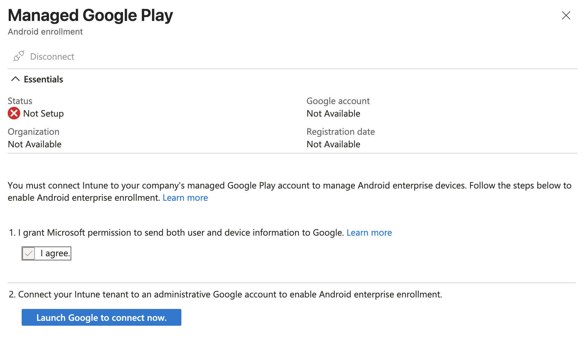
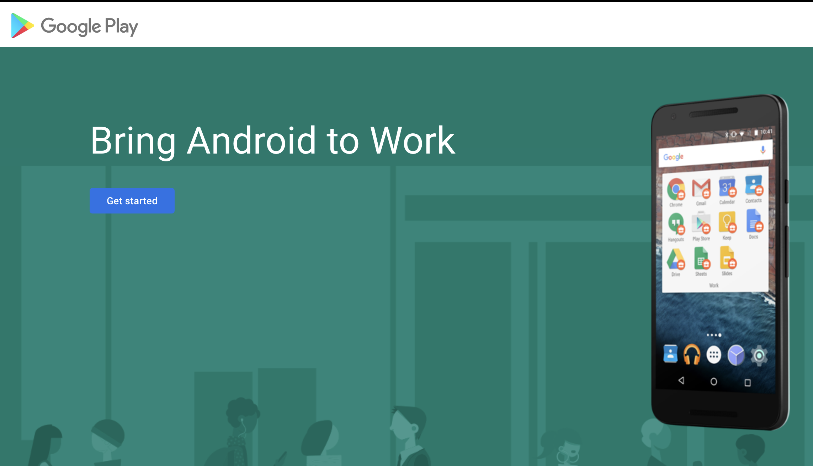
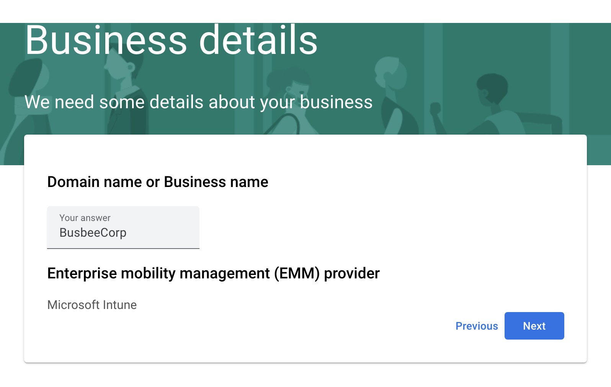
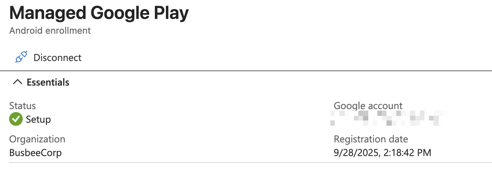
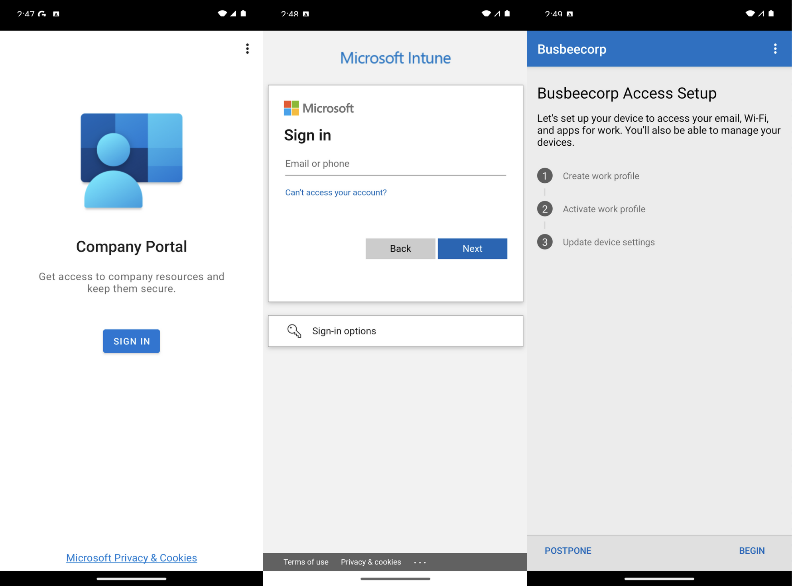
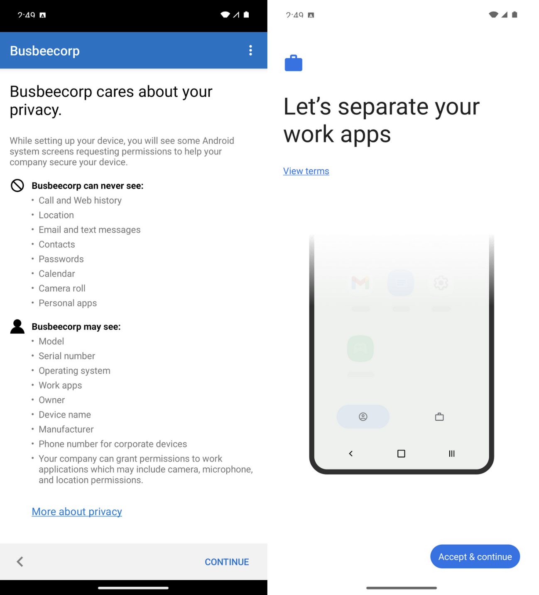
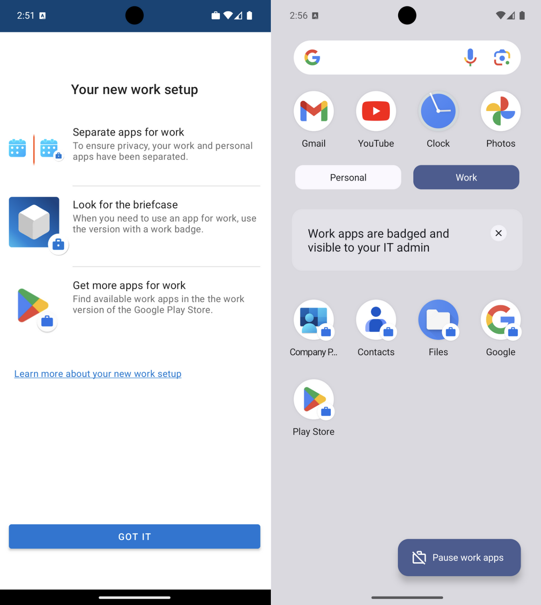

[← Previous](07-enrolling-iphones.md) &nbsp;|&nbsp; [Next →](09-monitor-and-report.md)

---

# Enrolling Androids

## Benefits of Managed Androids

Android enrollment in Intune works a bit differently than iOS. Rather than installing a configuration profile that gives Intune control over the whole device, Android uses a **work profile** model. This creates a separate, isolated container on the device for work apps and data. The user's personal apps stay completely separate and the organization only has visibility and control within the work profile. Apps provided through Intune show up with a briefcase icon in the corner to distinguish them from personal apps, and the app drawer splits into two folders: Personal and Work.

This model works well for BYOD environments because employees can feel confident that IT cannot see their personal photos, messages, or apps. The organization gets the control and security it needs, and the user keeps their privacy.

## Managed Google Play

The connection between Intune and Android devices runs through **Managed Google Play**. This is how Intune delivers apps and enforce policies on Android devices, similar to how the Apple Push Notification service sits between Intune and iPhones. Without this connection, Intune has no way to reach Android devices.

To make the connection just go to `Intune > Devices > Enrollment > Android > Managed Google Play` which will open a blade allowing you to give permission to Intune to connect to Google Play then a button to log in with a Google account.

In a real scenario you would want to use a secure Google account managed by the organization but for the purposes of this lab I think it will be fine to just use a personal account. It will warn you that using a personal account limits you to Android only but this is fine since we don't plan on doing anything with Chromebooks or Google Workspace in this lab.

After logging in you should see a splash screen. Click the Get Started button. Next it will ask for your company name -- here you can just put the name of your fake organization as well as your contact info when it asks for company officers.

If everything worked correctly you should be able to go back to the Managed Google Play screen and see a successful Setup Status.

## Testing Enrollment

To test enrollment I grabbed a virtual Android install from Android Studio and once it finished setting up I went to the Google Play Store and downloaded the Intune Company Portal app. Using Android Studio here is a handy workaround since it saves you from needing a physical Android device to test with.

When the app finishes downloading, open it and sign in with an organization account. It will then give you a rundown of what goes into enrolling the device with Intune.

When you click Begin it will give you an outline of what the organization is and is not able to see through this Intune Company Portal connection. Click Accept & Continue.

Once you move on you will be shown a screen explaining that your work and personal apps will now be separated. Apps for work will come with a briefcase icon in the bottom right corner to differentiate themselves, and the app drawer will now show two separate folders for Personal and Work apps. You can tap the Google Play for Work icon to browse apps provided by the organization.

Once enrollment completes, the device will appear in the Intune portal under `Intune > Devices > Android` where you can confirm it is enrolled and review its compliance status, OS version, and management state.

From here, the same compliance policies and app assignments we set up earlier can be targeted at the All-Android group to keep managed Android devices held to the same security standards as the rest of the fleet.

---

[← Previous](07-enrolling-iphones.md) &nbsp;|&nbsp; [Next →](09-monitor-and-report.md)

