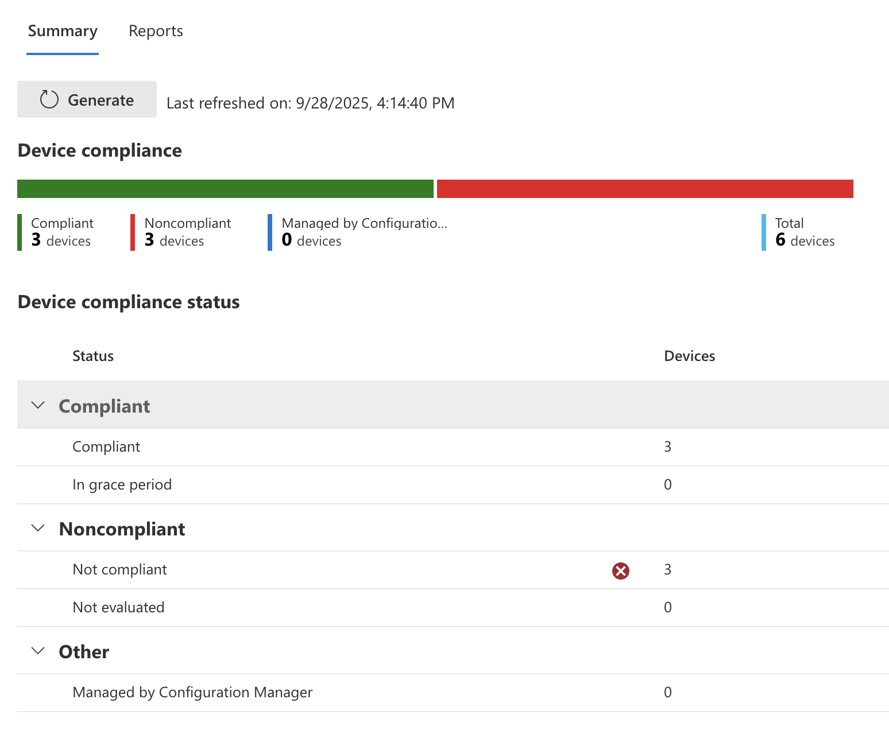
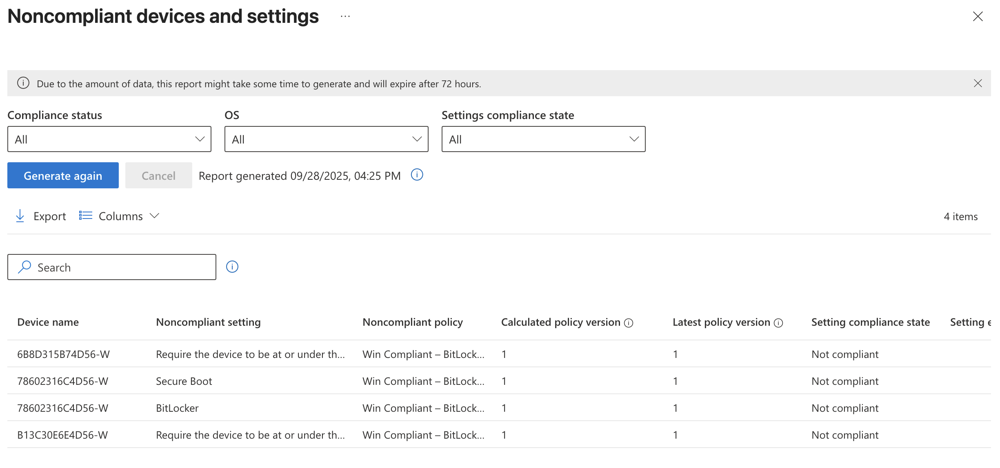
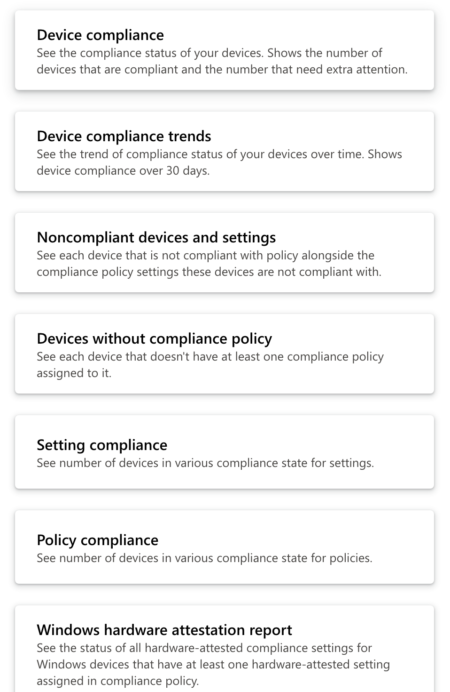
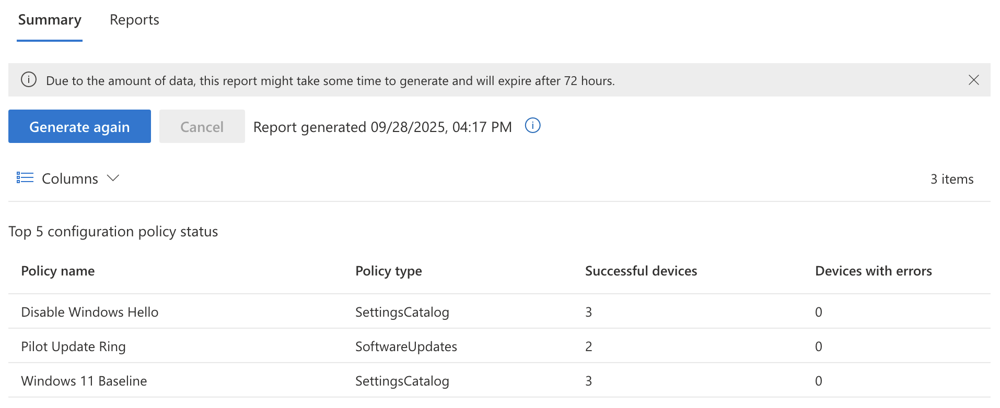
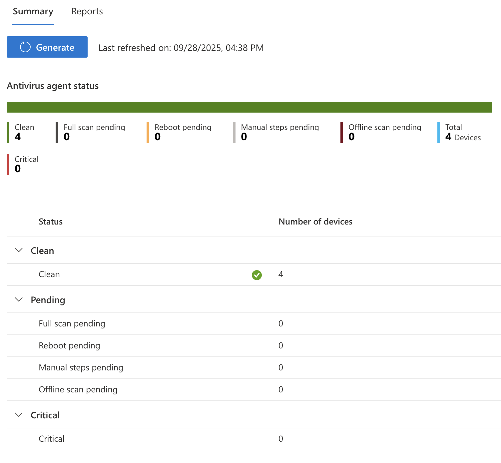
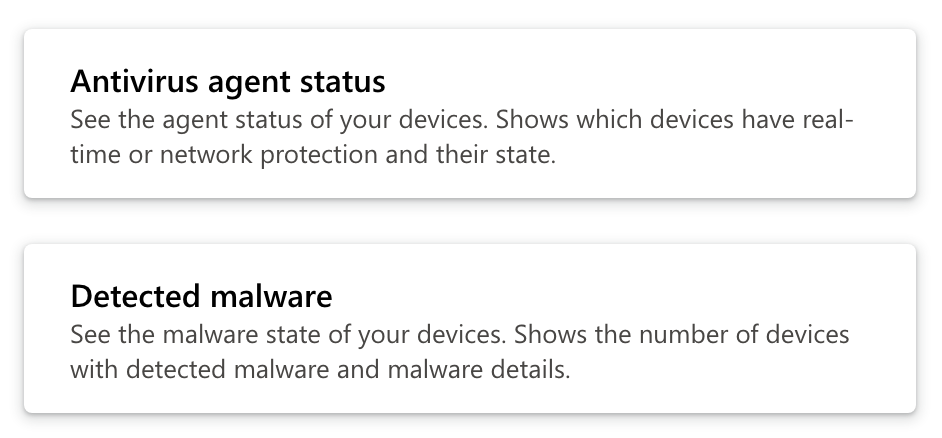
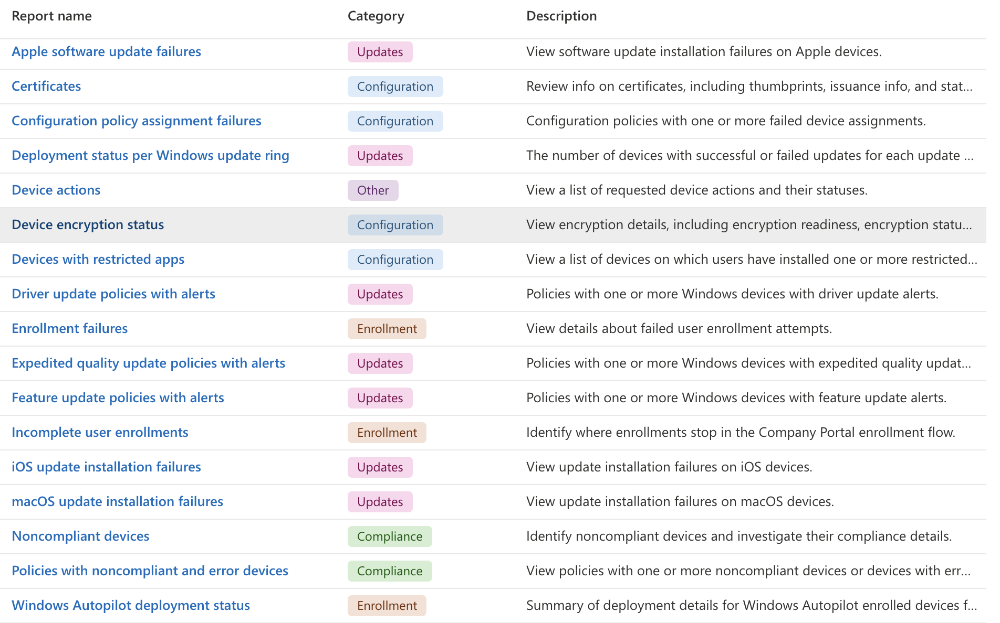
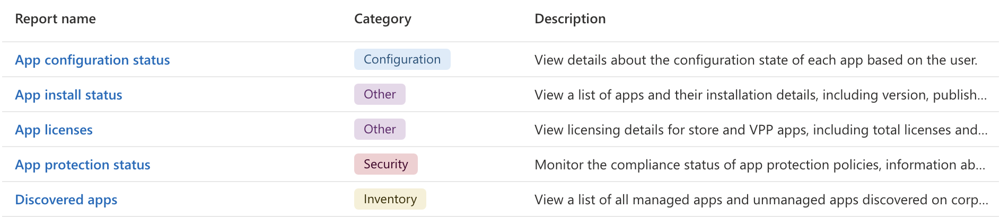

[← Previous](08-enrolling-androids.md) &nbsp;|&nbsp; [Next →](10-conclusion.md)

---

# Monitor and Report

## What Can I Monitor?

Deploying devices and policies is only half the job. The other half is knowing whether everything is actually working. Intune provides several built-in reporting tools that give IT teams visibility into device compliance, configuration policy status, antivirus health, and app deployment success. This section walks through the main reporting areas and what each one tells you.

## Compliance Reports

Go to `Intune > Reports > Device compliance` to view a summary of device compliance across the environment. If nothing shows here you may need to click the "Generate" button to refresh the data on the page.

This dashboard gives you an at-a-glance breakdown of compliant vs. noncompliant devices. In a real environment this is one of the first places you would check if a user is being blocked by Conditional Access -- if their device shows as noncompliant here, that tells you exactly why they cannot get in and where to start troubleshooting. You can drill further and generate a Noncompliant devices and settings report to see not just which devices are failing but which specific policy settings they are failing on.

The full list of built-in compliance reports lives at `Intune > Reports > Device compliance > Reports`.

Options include:

- Device Compliance
- Device Compliance trends
- Noncompliant devices and settings
- Devices without compliance policy
- Settings compliance
- Policy compliance
- Windows hardware attestation report

The "Devices without compliance policy" report is worth calling out specifically. In a growing environment it is easy for devices to slip through without a policy assigned, and this report surfaces those gaps before they become a security problem.

## Configuration Reports

Go to `Intune > Reports > Device configuration` to see a summary of configuration policies and their success and failure totals per device.

If a policy is showing failures here it usually means either the device has not checked in recently, there is a conflict between two policies targeting the same setting, or the device does not meet the requirements for the policy to apply. Clicking into a specific policy will show you the per-device breakdown so you can narrow down which devices are affected.

## Microsoft Defender Antivirus

Go to `Intune > Reports > Microsoft Defender Antivirus` to see a summary of antivirus status across devices managed by Intune. It breaks down the number of devices by status such as clean, pending, critical, and so on.

In the Reports section of this page you can also generate a detected malware report to see any threats that have been flagged across endpoints.

In production this is a report you would want to review regularly. A device sitting in a "critical" state that nobody has acted on is a real risk, and having this visible in Intune means you do not need a separate tool just to check antivirus health.

## Device and App Monitoring

Both `Intune > Devices` and `Intune > Apps` have their own Monitoring section with a list of reports specific to their category.

Screenshot of available Device reports:

Screenshot of available App reports:

The app reports are particularly useful after a new deployment. If you pushed an app to 25 devices and only 20 show as installed, the install failure report will tell you which devices failed and surface any error codes to help diagnose the issue.

With monitoring in place the lab environment is now as close to a production setup as a free trial tenant can get. Devices are enrolled, apps are deployed, security policies are enforced, and we have the reporting tools to know when something is off. The last step is collecting the artifacts from the environment before closing it out.

---

[← Previous](08-enrolling-androids.md) &nbsp;|&nbsp; [Next →](10-conclusion.md)

