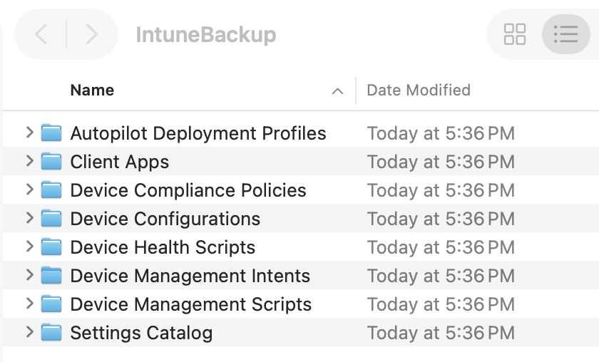
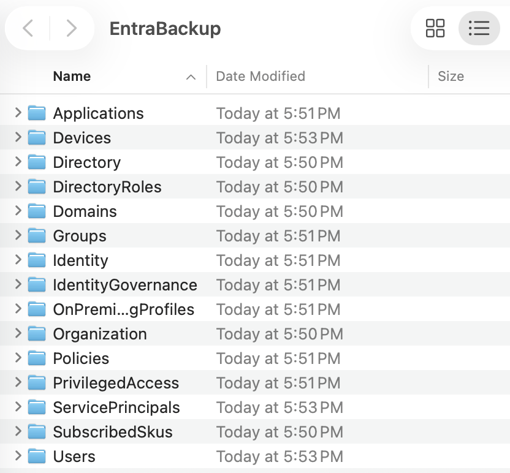
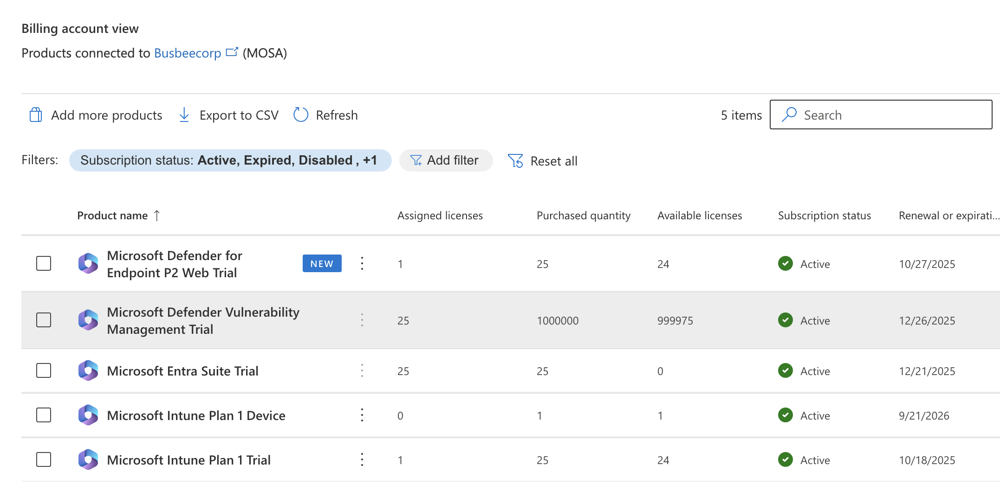

<div align="center">

[← Previous](09-monitor-and-report.md)

</div>

---

# Conclusion

## Wrapping Up

There are plenty of stones left unturned in this lab. Microsoft 365 is a deep environment and it would take far longer than a free trial to explore everything it has to offer. That said, I am happy with how much ground we covered and genuinely excited to take these skills into a more complex real-world environment someday.

Before closing everything out there were a couple of housekeeping items worth doing properly: exporting the lab configuration as artifacts and canceling the free trial subscriptions.

## Collecting Lab Artifacts

The first thing I wanted to do was export as much of the lab environment as possible into the GitHub repository. Saving users, groups, policies, and profiles means that if I spin up a new lab down the road I can import these artifacts and get back up to speed much faster than starting from scratch.

```powershell
Install-Module Microsoft.Graph -Scope CurrentUser -Force
Connect-MgGraph -Scopes "Group.ReadWrite.All" -TenantID "<TenantID>"
Install-Module IntuneBackupAndRestore -Scope CurrentUser -Force
Import-Module IntuneBackupAndRestore
Connect-MgGraph -Scopes `
  "DeviceManagementConfiguration.Read.All", `
  "Device.Read.All", `
  "DeviceManagementApps.Read.All", `
  "DeviceManagementManagedDevices.PrivilegedOperations.All" 
cd ~/Desktop
Start-IntuneBackup -Path ./IntuneBackup
```

Running the commands above prompted me to sign in with my Microsoft account, then connected to Intune and downloaded all configurations into a folder on the Desktop called IntuneBackup.



Inside the folder there were several subfolders containing app assignments, policies, profiles, scripts, and settings. Next I ran a similar export for Entra.

```powershell
Install-Module EntraExporter -Scope CurrentUser -Force
Import-Module EntraExporter
Connect-EntraExporter
Export-Entra -Path ~\Desktop\EntraBackup -All
```



I decided it was safe to commit this data to the public repository since all of the user data in the tenant is synthetic. I did remove my own personal user account from the export before pushing it up.

> In a real environment you would not want to publicly host user data in JSON files, and you would especially not want to share compliance or Conditional Access policy configurations. A threat actor could use that information to identify gaps and build a plan around your defenses.

## Ending The Free Trial

The last thing I wanted to take care of was canceling the free trial subscriptions to make sure nothing rolls into a paid plan unexpectedly. You can find all active subscriptions by going to `Microsoft 365 Admin > Billing > Your products` and canceling each one from there.



Fortunately the default setting already had recurring billing turned off, so the trials were set to expire naturally at the end of the 30 day period. I left the tenant itself intact for now in case I need to reference anything, but deleting the Microsoft account entirely is an option if you want a clean break.

## Reflection

This lab covered a lot of ground. The parts I found most valuable were the Autopilot and OOBE configuration, where small decisions like naming templates and Hello for Business settings make a real difference in the end user experience, and the security section, where compliance policies and Conditional Access work together in a way that only really clicks once you have built both sides of it yourself.

The PowerShell work throughout was a good reminder that doing things through the portal and doing things at scale are two very different problems. Being able to script group creation, license assignment, and configuration exports is what separates someone who knows the product from someone who can actually operate it.

There is plenty left to explore: Apple Business Manager for zero-touch iPhone provisioning, MAM policies for app-level data protection, and more advanced Conditional Access scenarios are all natural next steps. For now though, this lab did exactly what it was supposed to do.

---

<div align="center">

[← Previous](09-monitor-and-report.md)

</div>